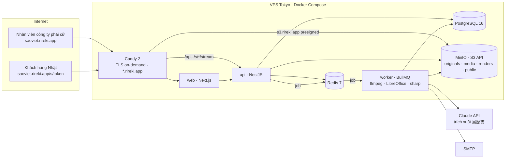

# Rireki — Đề xuất tech stack & đóng gói Docker

> Phạm vi: giai đoạn 1 (miễn phí), một VPS đặt tại Nhật, đóng gói toàn bộ bằng Docker Compose.
> Ảnh/video/tài liệu lưu trên **MinIO** (S3 API) để sau này chuyển sang AWS S3 (hoặc Wasabi, Cloudflare R2) mà không đổi code.

## 1. Tóm tắt đề xuất

| Lớp | Lựa chọn | Vì sao |
|---|---|---|
| Frontend (tenant app + trang khách) | **Next.js 15 (React, TypeScript)**, Tailwind CSS, `next-intl` (5 ngôn ngữ), `hls.js` | SSR đọc được subdomain từ `Host` để resolve tenant; middleware chặn/định tuyến; i18n có sẵn; chuyển trực tiếp token màu/thành phần từ bộ mockup |
| Backend API | **NestJS (TypeScript)** + **Prisma** | Cấu trúc module rõ (tenant, auth, candidates, shares, tracking), chung ngôn ngữ và kiểu dữ liệu với frontend, một đội nhỏ bảo trì được |
| Worker nền | **BullMQ** (Node) + `ffmpeg`, LibreOffice headless, `poppler`, `sharp` | Chuyển mã video → HLS, DOCX→PDF→ảnh trang, ghép watermark, gửi email, dọn file tạm |
| Trích xuất CV bằng AI | **Claude API** (`claude-opus-5-5`, structured outputs, PDF/ảnh đầu vào) | Đọc trực tiếp PDF/ảnh chụp CV tiếng Việt/Myanmar/Bengal/Indo/Nhật, trả JSON đúng schema 履歴書; không cần OCR riêng. Khối lượng lớn: `claude-sonnet-5-5` rẻ hơn một nửa |
| CSDL | **PostgreSQL 16** | Multi-tenant bằng `tenant_id` trên mọi bảng (+ Row Level Security khi cần), full-text `pg_trgm` cho tìm theo tên/katakana/mã |
| Cache & hàng đợi | **Redis 7** | Session, rate-limit cổng mật khẩu, hàng đợi BullMQ, đếm lượt xem gần thời gian thực |
| Object storage | **MinIO** (S3 API) → AWS S3 sau | SDK `@aws-sdk/client-s3`, presigned URL ngắn hạn; đổi endpoint là xong |
| Reverse proxy / TLS | **Caddy 2** | Tự cấp chứng chỉ Let's Encrypt cho từng subdomain tenant (on-demand TLS), cấu hình 30 dòng |
| Email | SMTP (SES/SendGrid) qua Nodemailer; dev dùng **Mailpit** | Mời thành viên, link gửi khách, thông báo lượt xem |
| Giám sát | `pino` log JSON → Grafana Loki (tùy chọn), **Sentry**, healthcheck Docker | Đủ cho 1 VPS; thêm Prometheus khi tải tăng |
| CI/CD | GitHub Actions build image → GHCR → SSH `docker compose pull && up -d` | Khớp với repo hiện tại; Pages đã dùng Actions |

Ngôn ngữ duy nhất **TypeScript** ở web/api/worker: chia sẻ kiểu `Candidate`, `ShareLink`, schema zod/JSON của 履歴書 và 611 chuỗi i18n giữa các app.

## 2. Kiến trúc tổng thể



## 3. Multi-tenant theo subdomain

- DNS: `A rireki.app`, `A *.rireki.app` (wildcard) và `A s3.rireki.app` trỏ về VPS.
- Caddy cấp chứng chỉ **on-demand**: lần đầu có request tới `saoviet.rireki.app`, Caddy hỏi `GET http://api:3000/internal/tls/ask?domain=…`; API trả 200 nếu subdomain tồn tại trong bảng `tenants`, Caddy mới xin cert. Không cần plugin DNS, không cần wildcard cert. (Nếu muốn wildcard: build Caddy với module `caddy-dns/cloudflare`, xem `deploy/dockerfiles/caddy.Dockerfile`.)
- Next.js middleware đọc `Host` → `tenantSlug`, ghi vào header nội bộ; API nhận `X-Tenant` + session để scope mọi truy vấn theo `tenant_id`.
- Cookie phiên đặt theo từng subdomain (không dùng `Domain=.rireki.app`) để đăng nhập tenant A không hiện ở tenant B. Trang khách `/s/{token}` dùng cookie riêng, hạn ngắn.
- Mã nhân sự `AZ123456`: unique trên `(tenant_id, code)`; prefix 2 chữ in hoa + bộ đếm 6 chữ số trong bảng `tenants`, cấp trong transaction.

## 4. Lưu trữ MinIO và đường đi của file

| Bucket | Nội dung | Quyền | Lifecycle |
|---|---|---|---|
| `rireki-originals` | DOCX/PDF/ảnh CV gốc, video gốc, scan hộ chiếu, chứng chỉ | private, versioning bật | giữ vĩnh viễn; xoá theo tenant khi archive |
| `rireki-media` | HLS (`.m3u8`, `.ts`/`.m4s`), poster, thumbnail | private | giữ cùng nhân sự |
| `rireki-renders` | Ảnh từng trang 履歴書 đã render (PNG, 1600px) | private | tạo lại được, xoá sau 90 ngày không dùng |
| `rireki-uploads` | Upload đang dở (multipart) | private | tự xoá sau 1 ngày |
| `rireki-public` | Logo tenant, ảnh thương hiệu trang khách | public-read | — |

- **Upload**: trình duyệt xin presigned `PUT` (hoặc multipart cho video lớn) từ API → đẩy thẳng lên `s3.rireki.app` (Caddy → MinIO) → API ghi bản ghi `files` → đẩy job vào BullMQ.
- **Video**: worker tải gốc → `ffmpeg` → HLS 2 mức (720p/480p) + poster, **ghi watermark tĩnh** (mã nhân sự + "Confidential") vào khung hình → ghi `rireki-media`. Khi khách xem: API cấp manifest động, mỗi segment là presigned URL 60 giây gắn với phiên xem; player (`hls.js`) phủ thêm watermark động (tên, email, giờ của người xem). Không có endpoint tải MP4 cho link chỉ xem.
- **CV**: DOCX → PDF (LibreOffice) → ảnh trang (`pdftoppm`) → `rireki-renders`. Link chỉ xem: API lấy ảnh nền, ghép watermark người xem bằng `sharp` (vài ms), trả về với `Cache-Control: no-store`. Link cho tải: presigned GET 5 phút tới PDF, mỗi lần tải ghi `ViewEvent(download)`.
- **Chuyển sang AWS S3**: đổi `S3_ENDPOINT`, `S3_REGION`, bỏ `S3_FORCE_PATH_STYLE`; đồng bộ dữ liệu bằng `mc mirror minio/rireki-originals s3/rireki-originals`. Khuyến nghị để MinIO ở chế độ single-node với ổ riêng, bật `mc mirror` định kỳ sang S3 làm backup từ ngày đầu.

## 5. Trích xuất 履歴書 bằng Claude API

- Worker nhận file → nếu DOCX thì chuyển PDF → gửi PDF (base64 hoặc Files API, ≤32 MB, ≤100 trang) kèm schema JSON của 履歴書 (đúng 7 bước form) dưới dạng `output_config.format` → nhận JSON có sẵn `confidence` cho từng trường → lưu `candidate_drafts` để nhân viên kiểm tra (màn hình `candidate-import`).
- Model mặc định `claude-opus-5-5` (đọc tốt chữ viết tay, bảng, tiếng Myanmar/Bengal); ước tính 3–6K token/CV → khoảng 0,03–0,05 USD mỗi CV. Khối lượng lớn hoặc bulk import: `claude-sonnet-5-5` (2 USD/10 USD mỗi triệu token) hoặc Batches API (giảm 50%).
- Dùng SDK chính thức `@anthropic-ai/sdk`; bật streaming cho file dài; `max_tokens` ~16000; khóa API đặt trong `.env` của worker, không bao giờ gửi ra frontend.
- Dữ liệu cá nhân: gọi API với tổ chức đã bật retention phù hợp; không log nội dung CV; chỉ lưu kết quả JSON trong Postgres.

## 6. Bảo mật & bảo vệ nội dung

- Đăng nhập email + mật khẩu (argon2id), session trong Redis, cookie `HttpOnly; Secure; SameSite=Lax`, khóa 15 phút sau 5 lần sai.
- Cổng link khách: token 22 ký tự ngẫu nhiên trong URL; mật khẩu (argon2id); rate-limit theo IP+token bằng Redis; ghi `failed_password`.
- Mọi URL file là presigned ngắn hạn, gắn `tenant_id` và phiên; không có URL cố định tới file riêng tư.
- Chế độ chỉ xem: ảnh trang có watermark server-side + lớp phủ client, chặn in/chuột phải/phím tắt, làm mờ khi mất focus (đã mô phỏng trong mockup). Browser không chặn được screenshot của hệ điều hành — nêu rõ trong UI.
- Audit log (bảng `audit_logs`), backup Postgres hằng đêm (giữ 14 ngày), MinIO mirror sang S3.

## 7. Đóng gói Docker

Toàn bộ chạy bằng một file `deploy/docker-compose.yml` (chi tiết trong `deploy/README.md`):

| Service | Image | Vai trò | Profile |
|---|---|---|---|
| `caddy` | `caddy:2` | TLS, reverse proxy, phục vụ mockup tĩnh tại `design.{DOMAIN}` | mặc định |
| `postgres` | `postgres:16-alpine` | CSDL | mặc định |
| `redis` | `redis:7-alpine` | cache/queue | mặc định |
| `minio` | `minio/minio` | object storage (console cổng 9001, chỉ bind localhost) | mặc định |
| `minio-init` | `minio/mc` | tạo bucket, policy, lifecycle, user ứng dụng | mặc định (chạy một lần) |
| `web` | build `apps/web` | Next.js | `app` |
| `api` | build `apps/api` | NestJS | `app` |
| `worker` | build `apps/worker` | BullMQ + ffmpeg/LibreOffice/poppler, font Noto JP/Myanmar/Bengali | `app` |
| `mailpit` | `axllent/mailpit` | hộp thư giả khi dev | `dev` |
| `pgbackup` | `prodrigestivill/postgres-backup-local` | dump hằng đêm | `prod` |

- `docker compose up -d` → hạ tầng + Caddy phục vụ bộ mockup (chạy được ngay hôm nay).
- `docker compose --profile app up -d --build` → thêm web/api/worker khi mã nguồn ứng dụng có trong `apps/`.
- Image ứng dụng build multi-stage trên `node:22-alpine` (web/api) và `node:22-bookworm-slim` (worker, vì cần ffmpeg + LibreOffice); chạy bằng user không phải root; có `HEALTHCHECK`.
- Cấu hình qua một file `.env` (mẫu `deploy/.env.example`); không có secret nào trong image.

## 8. Máy chủ & vận hành

- Khởi điểm: 1 VPS tại Tokyo (AWS Lightsail/EC2, Sakura, ConoHa, Vultr) **4 vCPU · 8 GB RAM · 160 GB SSD**; ổ riêng cho `/srv/minio`. Chuyển mã video là tác vụ nặng nhất: giới hạn worker 2 job song song (`WORKER_CONCURRENCY=2`).
- Dữ liệu đặt tại Nhật (khách hàng Nhật quan tâm), VN/MM truy cập qua HTTPS bình thường.
- Khi lớn hơn: tách MinIO sang S3 thật, Postgres sang managed (RDS), thêm worker thứ hai; Compose vẫn giữ nguyên, chỉ đổi `.env`.

## 9. Cấu trúc repo đề xuất (monorepo pnpm)

```
rireki/
├─ apps/
│  ├─ web/        # Next.js (tenant app + trang khách)
│  ├─ api/        # NestJS + Prisma (schema trong apps/api/prisma)
│  └─ worker/     # BullMQ processors: media, render, extract, mail
├─ packages/
│  ├─ shared/     # kiểu dữ liệu, schema 履歴書 (zod), hằng số
│  └─ i18n/       # 5 ngôn ngữ (chuyển từ assets/i18n.js)
├─ design/        # bộ mockup HTML hiện tại (index.html, app/, viewer/…)
├─ deploy/        # docker-compose, Caddyfile, Dockerfiles, minio/init.sh
└─ docs/          # tài liệu này
```

## 10. Lộ trình triển khai

1. **Tuần 1–2** · Khởi tạo monorepo, Prisma schema (tenants, users, candidates, cv, videos, documents, share_links, viewers, view_events, audit_logs), auth + subdomain, Compose chạy đủ hạ tầng.
2. **Tuần 3–4** · CRUD nhân sự, form 7 bước, upload MinIO, render 履歴書 (HTML → PDF/ảnh), danh sách + lọc.
3. **Tuần 5–6** · Worker video HLS + watermark, trích xuất CV bằng Claude, màn hình kiểm tra import.
4. **Tuần 7–8** · Link gửi khách (mật khẩu, định danh, chỉ xem/cho tải, hạn), trang khách, tracking, email thông báo.
5. **Tuần 9** · Thành viên & vai trò, cài đặt công ty/thương hiệu, audit log, backup, CI/CD, chạy thử với một công ty phái cử.
