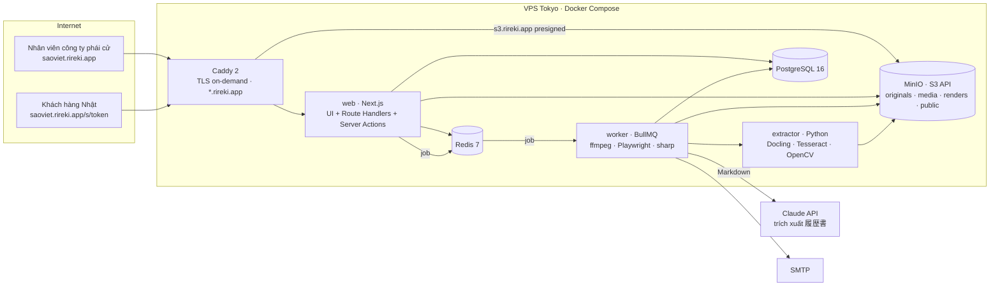
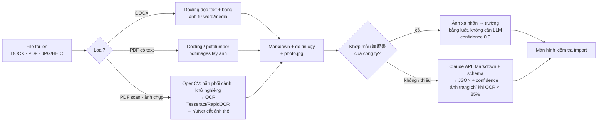

# Rireki — Đề xuất tech stack & đóng gói Docker

> Phạm vi: giai đoạn 1 (miễn phí), một VPS đặt tại Nhật, đóng gói toàn bộ bằng Docker Compose.
> Ảnh/video/tài liệu lưu trên **MinIO** (S3 API) để sau này chuyển sang AWS S3 (hoặc Wasabi, Cloudflare R2) mà không đổi code.

## 1. Tóm tắt đề xuất

| Lớp | Lựa chọn | Vì sao |
|---|---|---|
| Web + API (một app) | **Next.js 15 full-stack (React, TypeScript)**: UI + Route Handlers + Server Actions, `next-intl` (5 ngôn ngữ), `hls.js`, CSS lấy nguyên từ mockup | Một app thay vì web + API riêng: ít code nhất; SSR đọc subdomain từ `Host` để resolve tenant; không Tailwind/UI kit vì mockup đã có CSS |
| Auth | **better-auth** (email + mật khẩu, plugin `organization` = tenant, vai trò admin/user) | Không tự viết session/auth; không 2FA ở giai đoạn 1 |
| ORM | **Prisma** (`packages/db`), thân CV là một cột `Json` kiểm tra bằng zod | Ít bảng, ít migration; schema 履歴書 chỉ định nghĩa một lần bằng zod |
| Worker nền | **BullMQ** (Node) + `ffmpeg`, **Playwright/Chromium**, `sharp` | Video → HLS, chụp trang 履歴書 từ chính route in của web (không cần LibreOffice cho mẫu của mình), ghép watermark, gửi email |
| Trích xuất CV | **extractor** (Python: Docling, Tesseract, OpenCV) + **Claude API** (`claude-opus-5-5`, structured outputs) | Text, bảng và ảnh thẻ được tách ở local (mục 5); CV theo mẫu công ty ánh xạ bằng luật không cần LLM; Claude chỉ nhận Markdown ~1–2K token cho CV lạ hoặc text tự do |
| CSDL | **PostgreSQL 16** | Multi-tenant bằng `tenant_id` trên mọi bảng (+ Row Level Security khi cần), full-text `pg_trgm` cho tìm theo tên/katakana/mã |
| Cache & hàng đợi | **Redis 7** | Session, rate-limit cổng mật khẩu, hàng đợi BullMQ, đếm lượt xem gần thời gian thực |
| Object storage | **MinIO** (S3 API) → AWS S3 sau | SDK `@aws-sdk/client-s3`, presigned URL ngắn hạn; đổi endpoint là xong |
| Reverse proxy / TLS | **Caddy 2** | Tự cấp chứng chỉ Let's Encrypt cho từng subdomain tenant (on-demand TLS), cấu hình 30 dòng |
| Email | SMTP (SES/SendGrid) qua Nodemailer; dev dùng **Mailpit** | Mời thành viên, link gửi khách, thông báo lượt xem |
| Giám sát | `pino` log JSON → Grafana Loki (tùy chọn), **Sentry**, healthcheck Docker | Đủ cho 1 VPS; thêm Prometheus khi tải tăng |
| CI/CD | GitHub Actions build image → GHCR → SSH `docker compose pull && up -d` | Khớp với repo hiện tại; Pages đã dùng Actions |

Ngôn ngữ duy nhất **TypeScript** ở web/worker (Python chỉ cho extractor): chia sẻ kiểu `Candidate`, `ShareLink`, schema zod của 履歴書 và 611 chuỗi i18n qua `packages/shared`.

## 2. Kiến trúc tổng thể



## 3. Multi-tenant theo subdomain

- DNS: `A rireki.app`, `A *.rireki.app` (wildcard) và `A s3.rireki.app` trỏ về VPS.
- Caddy cấp chứng chỉ **on-demand**: lần đầu có request tới `saoviet.rireki.app`, Caddy hỏi `GET http://web:3000/api/internal/tls/ask?domain=…`; web trả 200 nếu subdomain tồn tại trong bảng `tenants`, Caddy mới xin cert. Không cần plugin DNS, không cần wildcard cert. (Nếu muốn wildcard: build Caddy với module `caddy-dns/cloudflare`, xem `deploy/dockerfiles/caddy.Dockerfile`.)
- Next.js middleware đọc `Host` → `tenantSlug`, ghi header `x-tenant`; Route Handlers/Server Actions đọc header + session better-auth và scope mọi truy vấn theo `tenant_id`.
- Cookie phiên đặt theo từng subdomain (không dùng `Domain=.rireki.app`) để đăng nhập tenant A không hiện ở tenant B. Trang khách `/s/{token}` dùng cookie riêng, hạn ngắn.
- Mã nhân sự `AZ123456`: unique trên `(tenant_id, code)`; prefix 2 chữ in hoa + bộ đếm 6 chữ số trong bảng `tenants`, cấp trong transaction.

## 4. Lưu trữ MinIO và đường đi của file

| Bucket | Nội dung | Quyền | Lifecycle |
|---|---|---|---|
| `rireki-originals` | DOCX/PDF/ảnh CV gốc, video gốc, scan hộ chiếu, chứng chỉ | private, versioning bật | giữ vĩnh viễn; xoá theo tenant khi archive |
| `rireki-media` | HLS (`.m3u8`, `.ts`/`.m4s`), poster, thumbnail | private | giữ cùng nhân sự |
| `rireki-renders` | Ảnh từng trang 履歴書 đã render (PNG, 1600px) | private | tạo lại được, xoá sau 90 ngày không dùng |
| `rireki-uploads` | Upload đang dở (multipart) | private | tự xoá sau 1 ngày |
| `rireki-public` | Logo tenant, ảnh thương hiệu trang khách | public-read | — |

- **Upload**: trình duyệt xin presigned `PUT` (hoặc multipart cho video lớn) từ API → đẩy thẳng lên `s3.rireki.app` (Caddy → MinIO) → API ghi bản ghi `files` → đẩy job vào BullMQ.
- **Video**: worker tải gốc → `ffmpeg` → HLS 2 mức (720p/480p) + poster, **ghi watermark tĩnh** (mã nhân sự + "Confidential") vào khung hình → ghi `rireki-media`. Khi khách xem: API cấp manifest động, mỗi segment là presigned URL 60 giây gắn với phiên xem; player (`hls.js`) phủ thêm watermark động (tên, email, giờ của người xem). Không có endpoint tải MP4 cho link chỉ xem.
- **CV**: DOCX → PDF (LibreOffice) → ảnh trang (`pdftoppm`) → `rireki-renders`. Link chỉ xem: API lấy ảnh nền, ghép watermark người xem bằng `sharp` (vài ms), trả về với `Cache-Control: no-store`. Link cho tải: presigned GET 5 phút tới PDF, mỗi lần tải ghi `ViewEvent(download)`.
- **Chuyển sang AWS S3**: đổi `S3_ENDPOINT`, `S3_REGION`, bỏ `S3_FORCE_PATH_STYLE`; đồng bộ dữ liệu bằng `mc mirror minio/rireki-originals s3/rireki-originals`. Khuyến nghị để MinIO ở chế độ single-node với ổ riêng, bật `mc mirror` định kỳ sang S3 làm backup từ ngày đầu.

## 5. Trích xuất 履歴書: tách text và ảnh ở local, LLM chỉ nhận text

Nguyên tắc: **không gửi cả file PDF/ảnh cho LLM**. Một service `extractor` (Python, open source) đọc file ở local, trả về Markdown có bảng + ảnh thẻ đã cắt; Claude chỉ nhận Markdown (≈1–2K token) để ánh xạ vào schema 履歴書. Ảnh trang chỉ gửi kèm khi OCR có độ tin cậy thấp.

### 5.1 Công cụ open source (đã lọc theo giấy phép dùng được cho SaaS)

| Việc | Công cụ | Giấy phép | Ghi chú |
|---|---|---|---|
| Đọc DOCX/PDF/ảnh → Markdown có bảng, OCR, tách ảnh | **Docling** (IBM) | MIT | Một thư viện cho mọi định dạng: DOCX qua `python-docx`, PDF qua `docling-parse` + mô hình layout + TableFormer (giữ cấu trúc bảng 学歴/職歴 ngay cả từ ảnh scan), OCR cắm Tesseract/RapidOCR, `generate_picture_images=True` trả về từng ảnh trong tài liệu |
| OCR | **Tesseract 5** (`jpn`, `eng`, `vie`, `mya`, `ben`, `ind`) | Apache-2.0 | Có đủ ngôn ngữ cần; tiếng Nhật in ấn đạt tốt với `tessdata_best`; trả độ tin cậy từng từ để quyết định fallback |
| OCR tiếng Nhật/Việt chính xác hơn | **RapidOCR** (PaddleOCR trên ONNX) | Apache-2.0 | Nhẹ, không cần PyTorch; chưa hỗ trợ Myanmar/Bengali nên dùng song song với Tesseract |
| PDF có lớp text (không cần OCR) | **pdfplumber** / `pdftotext -layout` (poppler) | MIT / GPL (gọi CLI) | Lấy chữ + toạ độ ô bảng, nhanh (vài trăm ms/trang) |
| Ảnh nhúng trong PDF | `pdfimages -png` (poppler) hoặc `pypdf` | GPL (CLI) / BSD | Liệt kê kích thước, cắt ảnh có tỉ lệ 3:4 ở trang 1 |
| Ảnh nhúng trong DOCX | `zipfile` đọc `word/media/*` | — | DOCX là ZIP; ảnh thẻ nằm sẵn ở đó, không cần OCR |
| Tiền xử lý ảnh chụp điện thoại | **OpenCV** (tìm viền trang → `warpPerspective`, khử nghiêng, adaptive threshold) | Apache-2.0 | Bắt buộc với ảnh chụp như mẫu 3 trang ở trên (nghiêng, bóng đổ) |
| Phát hiện ảnh thẻ trên trang scan | **OpenCV YuNet** (face detector ONNX, `cv2.FaceDetectorYN`) | Apache-2.0 | Tìm mặt ở góc trên phải → cắt khung 3:4 quanh mặt; fallback cắt theo toạ độ ô 写真 của mẫu |
| HEIC từ iPhone | `pillow-heif` | LGPL | Chuyển sang JPEG trước khi xử lý |

Tránh **PyMuPDF / pymupdf4llm, MinerU** (AGPL, phải mua giấy phép thương mại) và **Marker / Surya** (GPL kèm điều kiện doanh thu); **Yomitoku** (OCR tiếng Nhật) chỉ cho phi thương mại.

### 5.2 Pipeline



1. **Nhận dạng loại file.** PDF: đếm ký tự lớp text (`pdfplumber`); dưới 50 ký tự/trang coi là scan.
2. **DOCX.** Docling → Markdown (bảng giữ nguyên hàng/cột). Ảnh thẻ: giải nén `word/media/`, chọn ảnh tỉ lệ 3:4 (0,7–0,8), cạnh ≥ 200 px, xuất hiện đầu tiên theo thứ tự tài liệu.
3. **PDF số.** Docling parse (hoặc pdfplumber khi chỉ cần text) → Markdown. Ảnh: `pdfimages -list` rồi cắt ảnh 3:4 ở trang 1; nếu không có ảnh nhúng (ảnh đã bị flatten) dùng cách của bước 4 trên trang render 300 dpi.
4. **Scan / ảnh chụp.** `pdftoppm -r 300` (hoặc ảnh gốc) → OpenCV tìm 4 góc trang, `warpPerspective`, khử nghiêng, chuyển xám + adaptive threshold → Docling với `force_full_page_ocr` và Tesseract `lang=jpn+eng` (+ `vie`/`mya`/`ben`/`ind` theo quốc gia tenant) → Markdown + điểm tin cậy trung bình. Ảnh thẻ: YuNet tìm mặt trong phần tư trên phải, cắt khung 3:4 (mở rộng 1,6× bề rộng mặt), upscale lên 600×800; nếu không thấy mặt, cắt theo toạ độ ô 写真 của mẫu đã nắn.
5. **Ánh xạ theo mẫu.** Nếu Markdown chứa các nhãn cố định của mẫu công ty (フリガナ, 氏名, 生年月日, 国籍, 学歴, 職歴, 免許・資格, 語学力, 配偶者, 身長, 服のサイズ, 宗教的に注意が必要な事項, 食べられないもの…), bộ luật `label → field` điền thẳng vào schema, kể cả bảng 学歴/職歴 (hàng = năm, tháng, nội dung, 入学/卒業). Phần lớn CV theo mẫu không cần LLM.
6. **LLM khi cần.** CV không theo mẫu, trường thiếu, hoặc text tự do (志望動機・自己PR) cần chuẩn hoá: gửi Markdown + JSON schema (structured outputs) tới `claude-opus-5-5`; system prompt + schema đặt trước và bật prompt caching (prefix ổn định) nên mỗi lần chỉ trả tiền phần Markdown; trang nào OCR tin cậy < 85% mới đính kèm ảnh trang đó. Khối lượng lớn: `claude-sonnet-5-5` hoặc Batches API.
7. **Kiểm tra.** Kết quả (trường + confidence + ảnh thẻ) hiện ở màn hình `candidate-import`; nhân viên xác nhận rồi lưu; file gốc và ảnh thẻ vào `rireki-originals`.

### 5.3 Token và chi phí

| Cách | Token vào / CV 3 trang | Token ra | Chi phí ước tính (Opus 5.5: 4 USD / 20 USD mỗi triệu) |
|---|---|---|---|
| Gửi thẳng PDF cho Claude | 5.000–9.000 (mỗi trang được xử lý như ảnh + text) | ~1.000 (JSON) | ≈ 0,04–0,06 USD |
| Text local → Claude, có cache prompt | 1.000–2.000 (+ ~1.500 cache đọc, giá 10%) | ~1.000 | ≈ 0,025–0,03 USD |
| Khớp mẫu bằng luật, không LLM | 0 | 0 | 0 |

Tiền chủ yếu nằm ở token ra (JSON), nên lợi ích lớn nhất của tách text local không chỉ là chi phí: chuỗi chính xác tuyệt đối (mã, số điện thoại, ngày tháng không bị "đọc nhầm"), nhanh hơn (OCR 3 trang ≈ 5–10 giây CPU), chạy được khi không có LLM, và không phải gửi ảnh chân dung ra ngoài khi không cần.

### 5.4 Đóng gói

Service `extractor` (Python 3.12, FastAPI) trong Compose, profile `app`: `POST /extract` nhận đường dẫn object trong MinIO, trả `{markdown, pages[], confidence, tables[], photo_key, template_match}`; worker Node gọi qua mạng nội bộ. Image dựng từ `python:3.12-slim` + `tesseract-ocr` và gói ngôn ngữ `jpn vie mya ben ind eng` + `poppler-utils` + `libgl1` (OpenCV) + `docling` (kéo PyTorch CPU, ảnh ~2,5 GB; chạy 2 request song song trên 2 vCPU là đủ cho vài chục CV/giờ). Phiên bản nhẹ không có mô hình layout (pdfplumber + Tesseract + OpenCV, ~600 MB) dùng được khi CV luôn theo mẫu công ty.

## 6. Bảo mật & bảo vệ nội dung

- Đăng nhập email + mật khẩu qua better-auth (session trong Postgres), cookie `HttpOnly; Secure; SameSite=Lax` theo từng subdomain, khóa 15 phút sau 5 lần sai.
- Cổng link khách: token 22 ký tự ngẫu nhiên trong URL; mật khẩu (argon2id); rate-limit theo IP+token bằng Redis; ghi `failed_password`.
- Mọi URL file là presigned ngắn hạn, gắn `tenant_id` và phiên; không có URL cố định tới file riêng tư.
- Chế độ chỉ xem: ảnh trang có watermark server-side + lớp phủ client, chặn in/chuột phải/phím tắt, làm mờ khi mất focus (đã mô phỏng trong mockup). Browser không chặn được screenshot của hệ điều hành — nêu rõ trong UI.
- Audit log (bảng `audit_logs`), backup Postgres hằng đêm (giữ 14 ngày), MinIO mirror sang S3.

## 7. Đóng gói Docker

Toàn bộ chạy bằng một file `deploy/docker-compose.yml` (chi tiết trong `deploy/README.md`):

| Service | Image | Vai trò | Profile |
|---|---|---|---|
| `caddy` | `caddy:2` | TLS, reverse proxy, phục vụ mockup tĩnh tại `design.{DOMAIN}` | mặc định |
| `postgres` | `postgres:16-alpine` | CSDL | mặc định |
| `redis` | `redis:7-alpine` | cache/queue | mặc định |
| `minio` | `minio/minio` | object storage (console cổng 9001, chỉ bind localhost) | mặc định |
| `minio-init` | `minio/mc` | tạo bucket, policy, lifecycle, user ứng dụng | mặc định (chạy một lần) |
| `web` | build `apps/web` | Next.js: UI + API routes + Server Actions (cũng trả lời `tls/ask` cho Caddy) | `app` |
| `worker` | build `apps/worker` | BullMQ + ffmpeg + Playwright/Chromium + sharp, font Noto JP/Myanmar/Bengali | `app` |
| `extractor` | build `apps/extractor` | Python: Docling, Tesseract (jpn/vie/mya/ben/ind/eng), OpenCV, FastAPI `POST /extract` | `app` |
| `mailpit` | `axllent/mailpit` | hộp thư giả khi dev | `dev` |
| `pgbackup` | `prodrigestivill/postgres-backup-local` | dump hằng đêm | `prod` |

- `docker compose up -d` → hạ tầng + Caddy phục vụ bộ mockup (chạy được ngay hôm nay).
- `docker compose --profile app up -d --build` → thêm web/worker/extractor khi mã nguồn ứng dụng có trong `apps/`.
- Image ứng dụng build multi-stage trên `node:22-alpine` (web) và `node:22-bookworm-slim` (worker: ffmpeg + Chromium của Playwright); extractor trên `python:3.12-slim`; chạy bằng user không phải root; có `HEALTHCHECK`.
- Cấu hình qua một file `.env` (mẫu `deploy/.env.example`); không có secret nào trong image.

## 8. Máy chủ & vận hành

- Khởi điểm: 1 VPS tại Tokyo (AWS Lightsail/EC2, Sakura, ConoHa, Vultr) **4 vCPU · 8 GB RAM · 160 GB SSD**; ổ riêng cho `/srv/minio`. Chuyển mã video là tác vụ nặng nhất: giới hạn worker 2 job song song (`WORKER_CONCURRENCY=2`).
- Dữ liệu đặt tại Nhật (khách hàng Nhật quan tâm), VN/MM truy cập qua HTTPS bình thường.
- Khi lớn hơn: tách MinIO sang S3 thật, Postgres sang managed (RDS), thêm worker thứ hai; Compose vẫn giữ nguyên, chỉ đổi `.env`.

## 9. Cấu trúc repo đề xuất (monorepo pnpm)

```
rireki/
├─ apps/
│  ├─ web/        # Next.js: UI + API routes + Server Actions (tenant app, trang khách, print route)
│  ├─ worker/     # BullMQ processors: media, render, extract (gọi extractor + Claude), mail
│  └─ extractor/  # Python FastAPI: Docling + Tesseract + OpenCV, POST /extract
├─ packages/
│  ├─ db/         # Prisma schema, migrations, seed, PrismaClient
│  └─ shared/     # zod schema 履歴書, hằng số, messages/{en,ja,vi,id,my}.json (sinh từ assets/i18n.js)
├─ .claude/       # agents/ · skills/ · workflows/build-rireki.js (xem mục 11)
├─ deploy/        # docker-compose, Caddyfile, Dockerfiles, minio/init.sh
├─ docs/          # tài liệu này
└─ index.html, app/, public/, viewer/, assets/   # bộ mockup = spec
```

## 10. Lộ trình triển khai

1. **Tuần 1–2** · Khởi tạo monorepo, Prisma schema (better-auth + candidates/cv Json/videos/documents/share_links/viewers/view_events/audit_logs), better-auth + subdomain, Compose chạy đủ hạ tầng.
2. **Tuần 3–4** · CRUD nhân sự, form 7 bước, upload MinIO, render 履歴書 (HTML → PDF/ảnh), danh sách + lọc.
3. **Tuần 5–6** · Worker video HLS + watermark; extractor (Docling/Tesseract/OpenCV, cắt ảnh thẻ, ánh xạ theo mẫu) + Claude cho CV lạ; màn hình kiểm tra import.
4. **Tuần 7–8** · Link gửi khách (mật khẩu, định danh, chỉ xem/cho tải, hạn), trang khách, tracking, email thông báo.
5. **Tuần 9** · Thành viên & vai trò, cài đặt công ty/thương hiệu, audit log, backup, CI/CD, chạy thử với một công ty phái cử.

## 11. Workflow agent để code ứng dụng

Trong `.claude/` có đủ cấu hình để Claude Code tự xây ứng dụng theo đúng bộ mockup, với luật xuyên suốt
**"chọn cách đơn giản hơn, ít code hơn, có thư viện thì dùng"** (ghi trong `CLAUDE.md`, mọi agent đều đọc).

| Thành phần | Nội dung |
|---|---|
| `CLAUDE.md` | Luật vàng, bảng quyết định (Next.js full-stack, better-auth, Prisma + Json, MinIO, BullMQ, Playwright, Docling, Claude), layout repo, lệnh, Definition of Done, phân vùng path khi chạy song song |
| `.claude/agents/` | 7 subagent: `planner` (viết spec, chỉ đọc), `fullstack-dev` (Next.js + Prisma), `worker-dev` (BullMQ/ffmpeg/Playwright), `extractor-dev` (Python), `devops` (scaffold, Docker, CI, tích hợp), `reviewer` (một lăng kính mỗi lần), `qa` (Vitest + Playwright e2e, 5 ngôn ngữ, 400px) |
| `.claude/skills/` | 10 skill: `rireki-conventions`, `rirekisho-schema` (zod + Prisma, nguồn sự thật), `mockup-to-nextjs`, `tenant-auth`, `storage-minio`, `media-pipeline`, `share-links-protection`, `cv-extraction`, `run-and-verify`, `review-checklist` |
| `.claude/workflows/build-rireki.js` | Script điều phối 5 pha: **Scaffold** (1 devops) → **Foundation** (3 lane song song: db · ui tĩnh · extractor, rồi tích hợp) → **Features** (pipeline 5 tính năng: spec → code → 3 lăng kính review → fix; lane theo path riêng) → **Integration & QA** (tối đa 3 vòng tích hợp + QA + fix) → **Review** (4 lăng kính toàn repo, xác minh đối kháng, fix, QA cuối) |

Chạy: trong Claude Code tại repo, `/workflow build-rireki` (hoặc "use a workflow build-rireki"); chạy từng pha bằng
`args: {"phases": ["scaffold"]}` … Ước tính ~45–60 agent, 6–10 triệu token cho một lượt đầy đủ; có thể resume
bằng `resumeFromRunId` khi sửa script.
